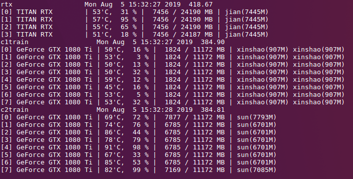

# Install
 ~~~
    pip install -r requirements.txt
 ~~~
# Usage
1. modify $USER and $PASSWORD in `list.sh`
2. modify `server_list.yaml` file as example
3. list all gpu resources on server list
    ~~~
    ./list.sh
    ~~~
    or show per second 
    ~~~
    watch -n 1 ./list.sh
    ~~~
    
# Demo

Demo result:

Watch result per second:

